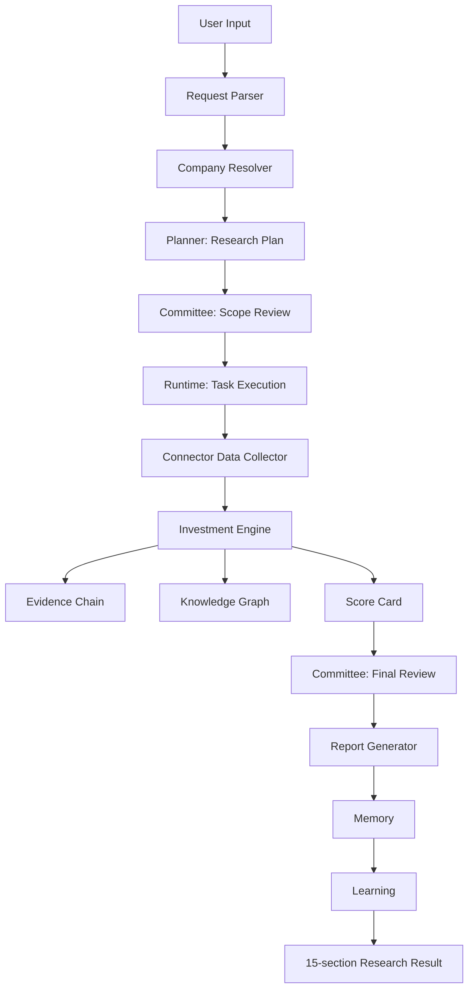

# APP-001 股票研究应用架构

免责声明：本文档仅说明 AIRS 股票研究应用的工程架构和研究质量控制流程，不构成投资建议，不提供荐股、自动交易、交易指令、目标价或收益承诺。

## 目标

APP-001 Equity Research App 将 AIRS 已有的 Planner、Committee、Runtime、Connector、Investment Engine、Knowledge Graph、Report Generator、Memory 和 Learning 串联为一个可直接运行的股票研究入口。用户只需输入股票代码、公司名称或研究问题，应用输出可追溯、可复核、带证据缺口的 15 段研究报告。

## 模块结构

```text
apps/equity_research/
├── app.py                 # 主入口和全链路编排
├── request_parser.py      # 用户输入解析
├── company_resolver.py    # 公司代码与基础信息识别
├── data_collector.py      # Connector 调用和证据卡转换
├── analyzer.py            # 综合分析和 Score/KG 组装
├── report_exporter.py     # 15 段报告导出
├── examples/              # 真实案例与降级说明
└── README.md              # 使用说明
```

## 全链路流程



## 关键边界

- Request Parser 只做解析，不补充无法验证的事实。
- Company Resolver 本地目录只用于路由，未命中时返回 `NEED_REVIEW`。
- Data Collector 只通过 `data_connectors` 调用外部源；Mock 或错误必须进入降级说明。
- Analyzer 只形成研究框架、证据链、KG、Score 和反方观点，不生成买卖动作。
- Report Exporter 必须输出 15 个 section，并在每节保留 Facts / Inference / Assumption / Opinion。
- Memory 只沉淀研究上下文和来源引用；Learning 只生成待评审改进建议，不自动修改生产规则。

## 与既有 FEATURE 的关系

- FEATURE-009 Planner：生成研究计划、执行顺序、方法论、资源和预算。
- FEATURE-010 Committee：在研究前后执行范围审议、证据挑战、少数报告和决策记录。
- FEATURE-006 Runtime：执行 Planner 生成的 runtime workflow。
- FEATURE-013 Connectors：提供真实数据接入边界和 Mock/SKIP 降级规则。
- FEATURE-008 Investment Engine：提供供应链、卡点、风险、催化、推荐语安全边界和结构化研究输出。
- FEATURE-002 Knowledge Graph：承载公司、行业、风险、证据和报告节点。
- FEATURE-003 Report Generator：生成内部 12 段 AIRS 报告，再由 APP-001 包装为股票研究 15 段报告。
- FEATURE-012 Learning：记录反馈与改进建议，默认 pending review。

## 治理原则

所有输出必须遵守三条硬约束：

- 不把 Mock 或 SKIP 数据冒充真实证据。
- 不输出荐股、自动交易、交易指令、目标价或收益承诺。
- 不把 Score Card 解释为投资评级；Score 只用于研究质量控制。

