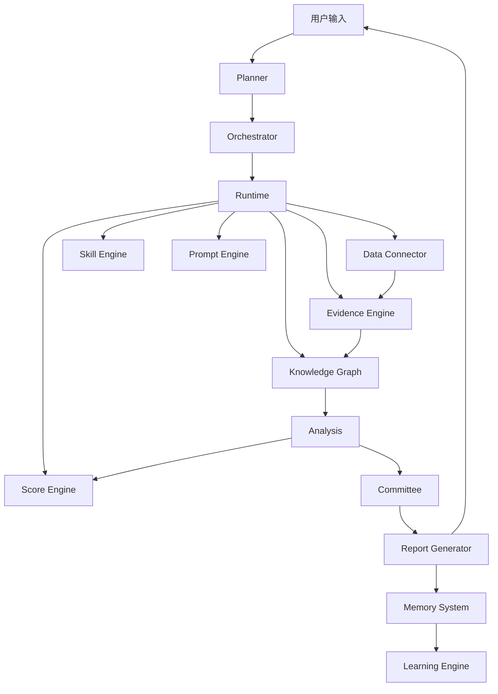

# 依赖映射 (DEPENDENCY_MAP)

```mermaid
graph TD
    User[用户输入] --> Planner[Planner]
    Planner --> Orchestrator[Orchestrator]
    Orchestrator --> Runtime[Runtime]
    
    Runtime --> Connector[Data Connector]
    Runtime --> Evidence[Evidence Engine]
    Runtime --> KG[Knowledge Graph]
    Runtime --> Skill[Skill Engine]
    Runtime --> Prompt[Prompt Engine]
    Runtime --> Score[Score Engine]
    
    Connector --> Evidence
    Evidence --> KG
    KG --> Analysis[Analysis]
    
    Analysis --> Score
    Analysis --> Committee[Committee]
    
    Committee --> Report[Report Generator]
    
    Report --> Memory[Memory System]
    Memory --> Learning[Learning Engine]
    
    Report --> User
```
