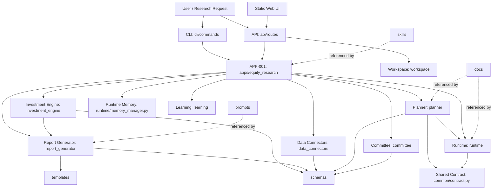
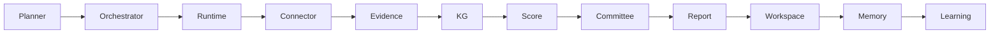
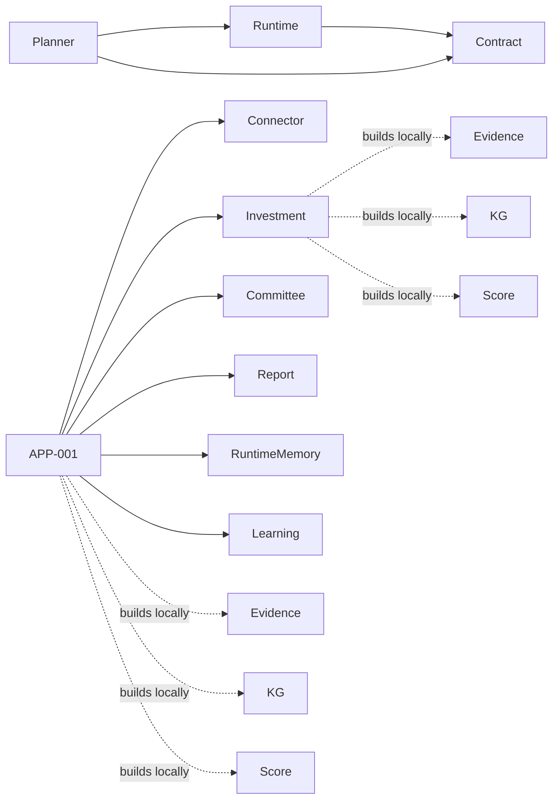
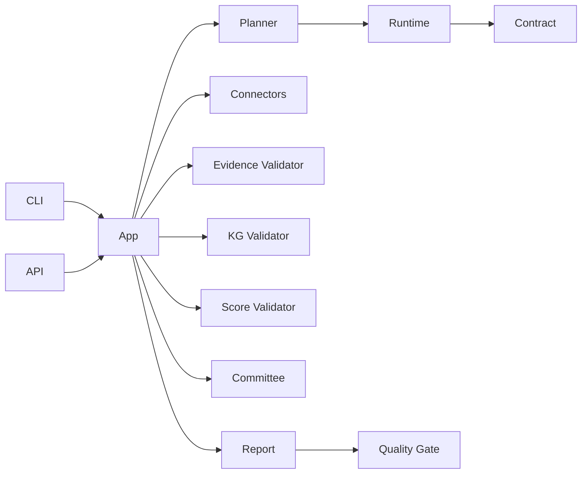

# AIRS Dependency Map

审计日期：2026-07-10

## Current Runtime Dependency Graph

## Intended Architecture vs Current Implementation

Intended chain:

Current implementation:

## Import-Based Observations

Observed import edges:

- `planner/engine.py` imports `common` and `runtime` references.
- `planner/runtime.py` imports `common`.
- `runtime/core.py` imports `common`.
- `apps/equity_research` imports `committee`, `data_connectors`, `investment_engine`, `learning`, `planner`, `report_generator`, `runtime`.
- `api/routes` imports `apps`, `runtime`, `workspace`.
- `cli/commands` imports `apps`.
- `tests/production-e2e` imports almost every Core module, but relies on harness semantics.

## Boundary Risks

1. Orchestrator is referenced by docs and Planner infrastructure refs, but has no executable top-level module.
2. Evidence, KG and Score exist as schemas/docs/modules unevenly; APP-001 and Investment Engine build these objects locally.
3. API and CLI are correctly thin, but inherit APP-001's boundary ambiguity.
4. Workspace, Runtime Memory and Learning are parallel concepts, not a single lifecycle model.

## Stable Dependency Target

Recommended v1.0 Stable minimal target:

This target avoids a large rewrite while closing the highest-risk contract gaps.
